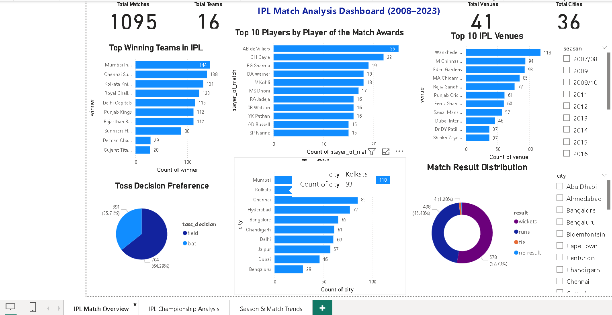
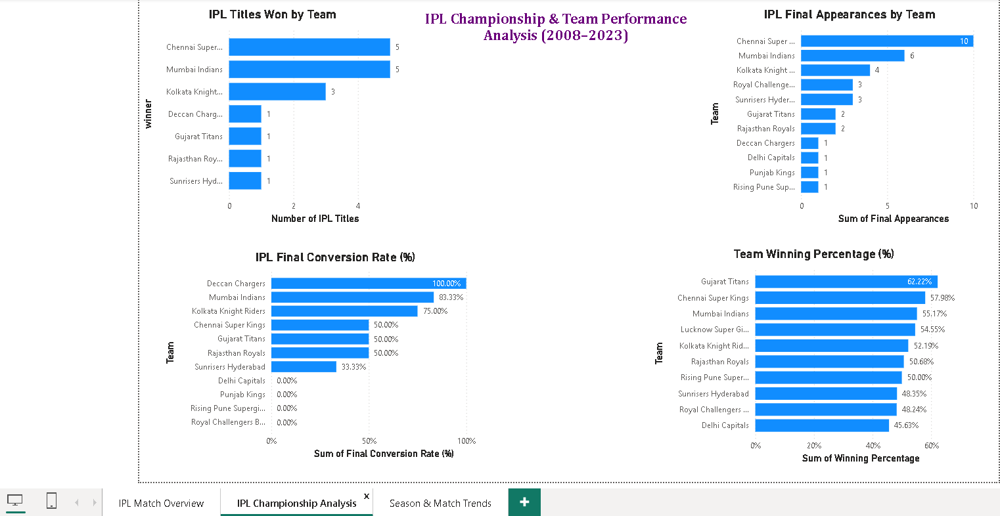
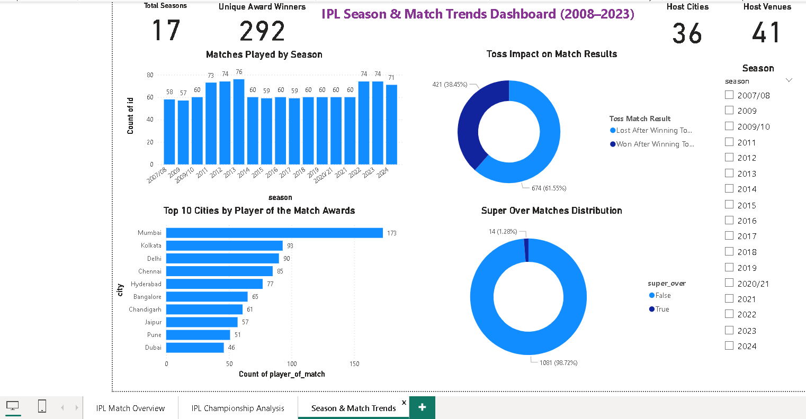

# IPL Data Analysis Project

## Project Overview

This project focuses on Exploratory Data Analysis (EDA) of the Indian Premier League (IPL) dataset using Python. The objective of this project is to analyze team performance, player achievements, match outcomes, venue statistics, and championship success patterns across IPL seasons.

The analysis was performed using Python libraries such as Pandas, Matplotlib, and Seaborn to extract meaningful insights and visualize important trends in IPL history.

---

## Dataset Information

The dataset contains IPL match-level information, including:

* Match ID
* Season
* City
* Venue
* Teams
* Toss Winner
* Toss Decision
* Match Winner
* Player of the Match
* Match Result
* Super Over Details
* Umpire Information

---

## Technologies Used

* Python
* Pandas
* NumPy
* Matplotlib
* Seaborn
* SQL
* Power BI
* Jupyter Notebook

---

## Project Workflow

Raw IPL Dataset
      ↓
Data Cleaning & Preprocessing (Python)
      ↓
Exploratory Data Analysis (EDA)
      ↓
SQL Analysis & Querying
      ↓
Data Preparation for Visualization
      ↓
Power BI Dashboard Development
      ↓
Business Insights & Reporting

---

## Analysis Performed

### 1. Total Wins by Team

Analyzed the number of matches won by each IPL franchise.

### 2. Toss Decision Analysis

Examined whether teams preferred batting or fielding first after winning the toss.

### 3. Player of the Match Analysis

Identified players with the highest number of Player of the Match awards.

### 4. Season-wise Match Analysis

Studied the number of IPL matches played in each season.

### 5. Top Venues Analysis

Determined which stadiums hosted the highest number of IPL matches.

### 6. Top Cities Analysis

Analyzed cities that hosted the most IPL matches.

### 7. Match Result Distribution

Explored how matches were won, either by runs or wickets.

### 8. Chasing Analysis

Investigated the impact of batting second on match outcomes.

### 9. Super Over Analysis

Examined the occurrence of Super Over matches in IPL history.

### 10. Total Matches Played by Team

Calculated the number of matches played by each IPL franchise.

### 11. Winning Percentage Analysis

Compared teams based on their overall winning percentage.

### 12. IPL Titles Won Analysis

Analyzed the number of IPL championships won by each team.

### 13. IPL Final Appearances Analysis

Identified teams with the highest number of IPL Final appearances.

### 14. Final Conversion Rate Analysis

Measured how efficiently teams converted Final appearances into IPL titles.

---

## Key Findings

* Mumbai Indians and Chennai Super Kings are the most successful IPL franchises, with 5 IPL titles each.
* Chennai Super Kings have the highest number of IPL Final appearances (10), demonstrating exceptional consistency.
* Mumbai Indians have one of the best Final conversion rates, winning 5 out of their 6 Final appearances.
* Gujarat Titans have the highest winning percentage among IPL teams.
* AB de Villiers has won the highest number of Player of the Match awards.
* Wankhede Stadium has hosted the highest number of IPL matches.
* Teams choosing to field first have shown a greater tendency to win matches, highlighting the advantage of chasing.
* Super Over matches are extremely rare in IPL history.

---

## Dashboard Insights

### Dashboard 1: IPL Match Overview

- Mumbai Indians recorded the highest number of wins (144), followed by Chennai Super Kings (138).
- AB de Villiers won the most Player of the Match awards (25).
- Wankhede Stadium hosted the highest number of IPL matches (118).
- Teams chose to field first after winning the toss in approximately 64% of matches.

### Dashboard 2: IPL Championship Analysis

- Chennai Super Kings reached the IPL Final 10 times, the highest among all franchises.
- Mumbai Indians converted 83.33% of their Final appearances into IPL titles.
- Kolkata Knight Riders achieved a 75% Final conversion rate.
- Gujarat Titans recorded the highest overall winning percentage (62.22%).

### Dashboard 3: IPL Season & Match Trends

- IPL seasons 2012 and 2013 recorded the highest number of matches.
- Teams winning the toss won 61.55% of matches.
- Mumbai hosted the highest number of Player of the Match performances.
- Only 1.28% of IPL matches were decided by a Super Over.

---

## Dashboard Screenshots

### Dashboard 1: IPL Match Overview

### Dashboard 2: IPL Championship Analysis

### Dashboard 3: IPL Season & Match Trends

---

## Conclusion

This project provides valuable insights into IPL team performance, player contributions, match strategies, and championship success. The analysis highlights the dominance of Mumbai Indians and Chennai Super Kings throughout IPL history while also showcasing the emergence of newer franchises such as Gujarat Titans. Through data visualization and statistical analysis, the project demonstrates how data can be used to understand trends and performance patterns in professional cricket.

---

## Skills Demonstrated

- Data Cleaning
- Exploratory Data Analysis (EDA)
- Data Visualization
- Python Programming
- SQL Querying
- Power BI Dashboard Development
- KPI Design
- Data Storytelling
- Business Intelligence Reporting

---

## Author

**Ashis Kumar Samal**

Data Analyst Enthusiast | SQL | Python | Excel | Power BI